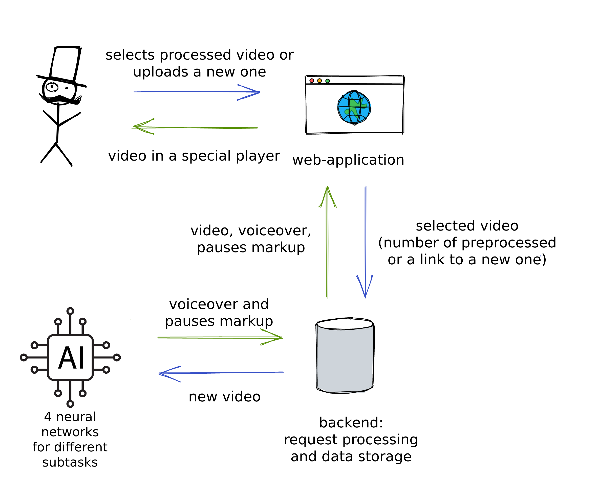

### тут название работы на английском

тут краткий текст из тезисов, который показывает проблематику

### Overall description of our method

**Interface**: user selects processed video or uploads a new one.
**Splitting video to scenes**: video is send to served which splits it into scened with neural networks.
**Scene description**: neural networks generate a description for every scene.
**Voiceover**: neural networks generate voiceover for every scene.
**Special player**: user watches video in a special player, which plays voiceover along with the original video.

[Here is a video demonstration of our method](https://www.youtube.com/watch?v=qOqBgw-SQ18)




### Suggestions for future work

- Improvement of the existing video stop system
- Inserting the background sound of a movie fragment over the voiceover of the announcer to avoid losing the atmosphere of the movie
- Better selection of model hyperparameters and model training
- Creation of a recommendation system based on the created text descriptions

### Running the system
Just install docker and run:
```bash
docker-compose up -d --build
```
The building can take quite a long time, because we use several heavy neural networks.

After that, the solution will be available at [http://localhost:1337 ](http://localhost:1337). You can upload your own video to test our system.
